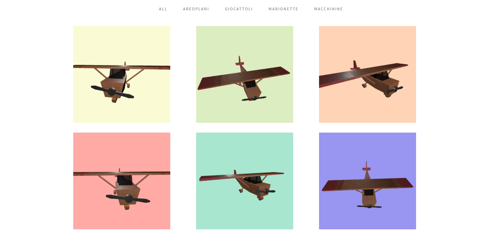

# Relazione 2° progetto - Product visualization

## Descrizione
Il progetto prevede la realizzazione di un sito e-commerce nel quale sia possibile la visualizzazione dei prodotti in vendita tramite l'utilizzo di un modello 3D.
Il sito realizzato vuole essere un e-commerce per la vendita di giocattoli in legno per bambini ed è proprio per questo motivo che non si è voluto rendere particolarmente realistico l'ambiente nel quale è posto l'oggetto 3D, pur avendo utilizzato formule e concetti per la realizzazione di un rendering fotorealistico (physically based rendering)

Il progetto è stato appositamente studiato per poter essere eseguito in ambiente web ed in particolare su un e-commerce nel quale possono essere presenti numerosi prodotti. Sia il modello 3D che le texture sono state scelte appositamente per poter occupare poca memoria e di conseguenza essere caricate il più velocemente possibile.

Il progetto è stato scritto utilizzando le nuove specifiche di javaScript ES6 che permettono la suddivisione del codice in moduli con la possibilità di espanderlo e riutilizzarlo facilmente nel caso si volessero caricare nuovi modelli e nuove texture come si presume accada in un e-commerce.

## Elementi
La struttura HTML e CSS del sito è stata presa da un template gratuito e successivamente modificata in base alle esigenze.
Il modello 3D è stato scaricato direttamente dall'asset store di Unity e successivamente modificato (soprattutto per quanto riguarda le coordinate UV) tramite il software di modellazione 3D Maya.
Tutte le texture sono state scaricate dal sito [Substances Share](https://share.allegorithmic.com/) e adeguatamente sistemate tramite il software Substance Player.

## Possibili implementazioni
I possibili miglioramenti che potrebbero venire apportati al progetto sono:
- La possibilità di cambiare colore alle varie parti del modello
- Una migliore illuminazione e rappresentazione delle ombre
- Una netta ottimizzazione delle texture utilizzando altri formati di compressione
